**ASISTENTE GENERADOR DE CUESTIONARIOS WEB**

# Requerimiento 1.0

> Fecha de creación del documento:06/09/2022
>
> Fecha de última actualización:06/09/2022

## 1.  **Objetivo**

> Por medio de un tutorial explicar paso a paso como crear un proyecto Vue desde cero(incluyendo instalacion,configuracion del ambiente,
> librerias,componentes,etc) y obtener una aplicacion de Login para el generador de cuestionarios.

## 2.  **Nombre de quien solicita**

Daniel Barba Aguayo

## 3.  **Propuesta de Solución**

## AGC

> El objetivo es obtener una aplicacion con la vista siguiente:


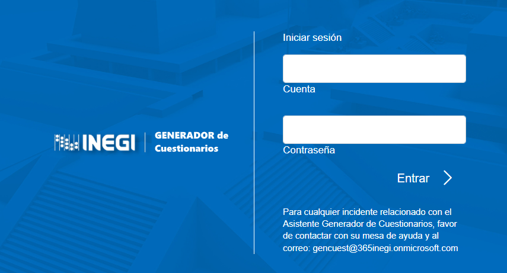

>*Vista de Login de la aplicacion generador de cuestionarios con Vue*

### Requerimientos

> Se necesitara tener Node.js instalado en tu sistema : https://nodejs.org/es/ .De este modo se podra usar los gestores de paquetes NPM.

Nota: existen diversos tutoriales para instalar node aqui uno de ellos https://www.neoguias.com/instalar-node-windows/ . Elegir el tutorial de su eleccion

> Observacion: En caso de ya tener previamente instalado node ignorar este paso.

### Instalacion de Visual Studio Code

+ Descargar VSC desde : https://code.visualstudio.com/
+ Instalar VSC y realizar la siguiente configuracion para tener disponible la terminal:
	> Abrir el menu File --> Preferences --> Settings 
 > Se abrira una caja de texto y se tiene que buscar "Terminal" y buscar: Integrated Automation profeil : linux

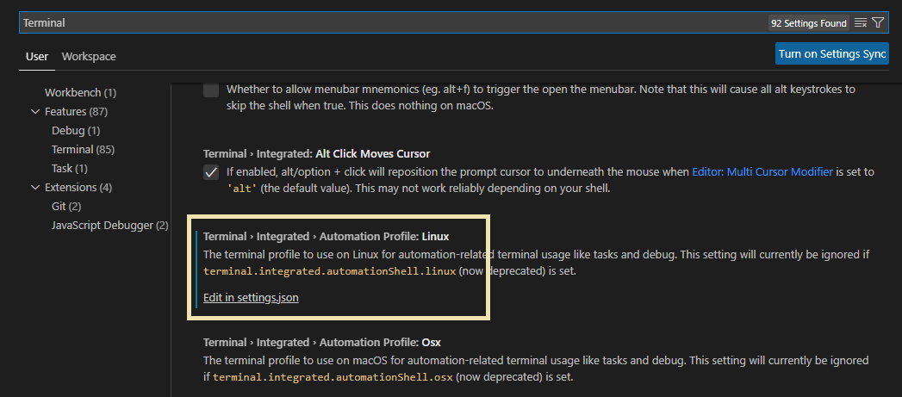

+ Editar y colocar el siguiente codigo sustituyendo el actual(es opcional si se respalda)

```
    ...
{
    "liveServer.settings.CustomBrowser": "chrome",
    "liveServer.settings.AdvanceCustomBrowserCmdLine": "",
    "liveServer.settings.donotShowInfoMsg": true,
    "terminal.integrated.defaultProfile.windows": "Command Prompt",
    "workbench.iconTheme": "vscode-icons",
    "debug.terminal.clearBeforeReusing": true,
    "workbench.colorTheme": "Markdown Editor Dark",
    "explorer.confirmDelete": false,
    "workbench.sideBar.location": "right",
    "terminal.integrated.automationProfile.linux": {
    }
}
    ...
```
	
### Crear un proyecto con lo esencial con VUE UI

+ Escribir en la terminal del VSC lo siguiente : vue ui

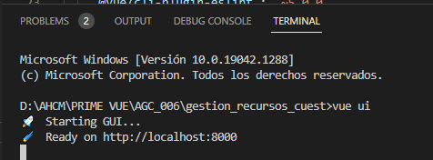

+ Ir a administracion de proyectos

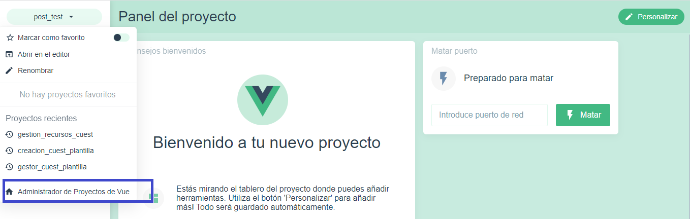

+ Crear 


+ Elegir el directorio donde se creara el proyecto y dar en "Crear nuevo proyecto aqui"

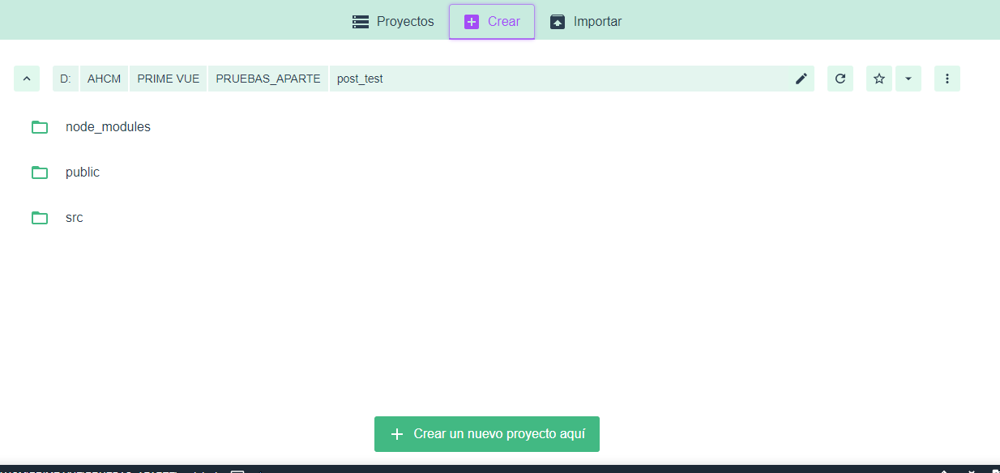

+ Asignar un nombre a tu proyecto, seleccionar en el gestor de paquetes npm,no seleccionar ninguna "opcional adicional" y marcar repositorio git

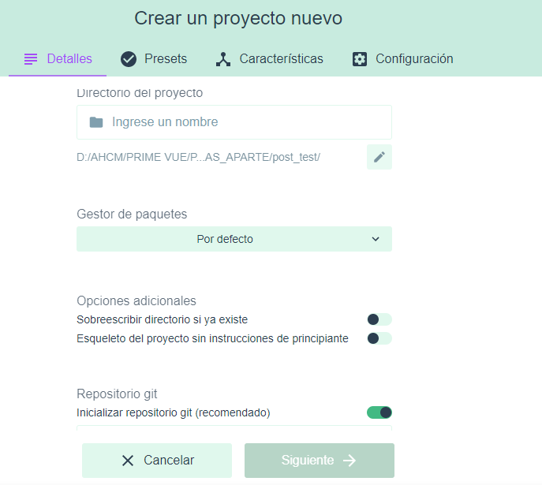

+ Selecionar "Manual"

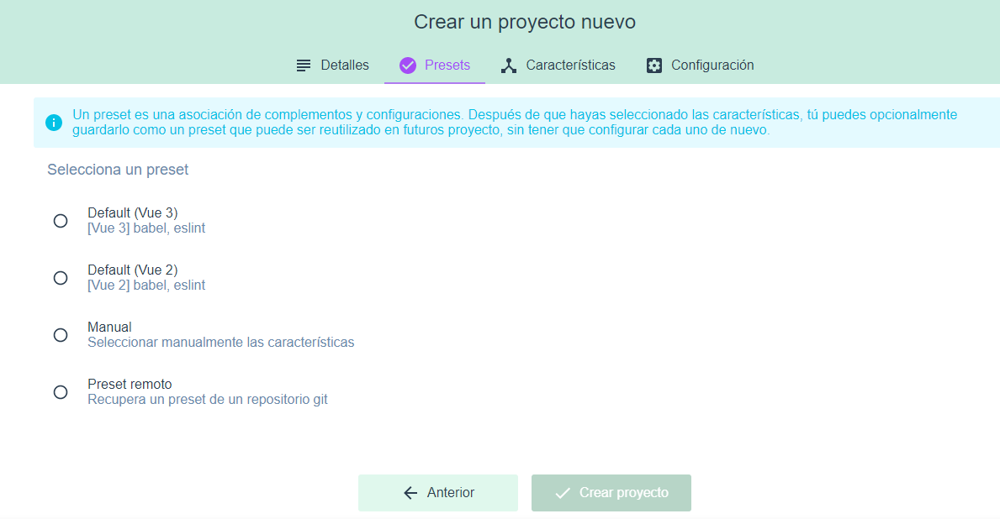

+ Marcar Babel,Router,Vuex y Linter Formatter; dejar desmacarcado lo demas

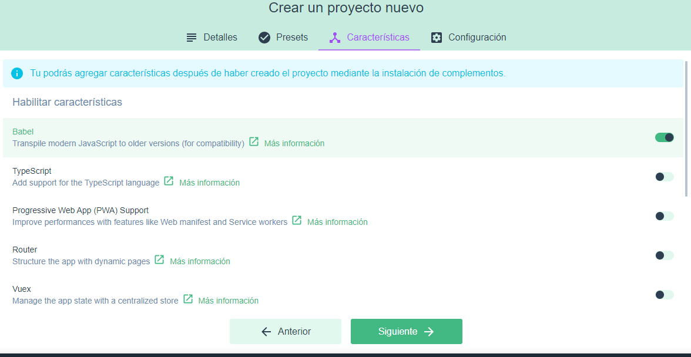

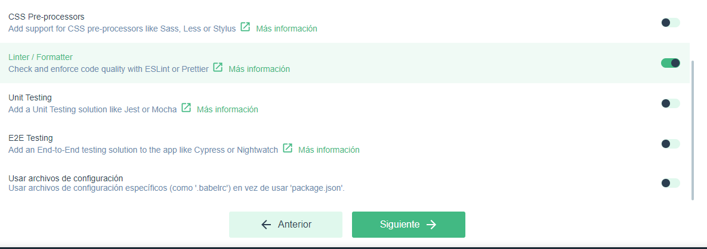

+ Seleccionar ESLint with error prevention only y marcar Lint on save en "Pick additional lint features

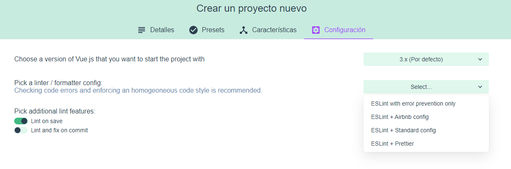

+ Dar click en "Crear proyecto" y dar click en "continuar sin guardar" y esperar a que termine exitosamente

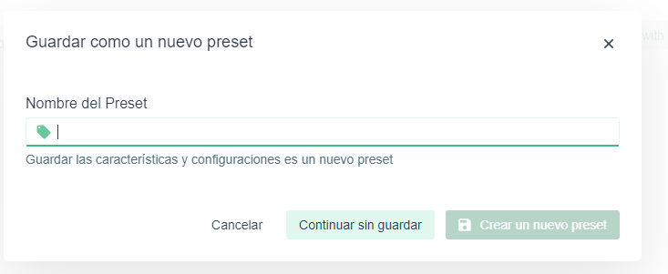

### Creacion de componentes "base" en el proyecto

+ Dentro del VSC click en File--->Open Folder, buscar y seleccionar la carpeta del proyecto creado

+ El proyecto debe visualizarse con esta estructura:

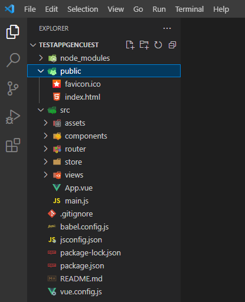

> + Para crear un componente simplemente click derecho en la carpeta views(vistas de vue router) y "New File" y creamos los siguientes:
> Login.vue,GlobalContent.vue
> De la misma forma en la carpeta components creamos:
	LayerMenuBarSecurity.vue,SideMenuBar.vue y ContentDesing.vue
	
+ Añadir los elementos correspondientes en el componente Login,LayerMenuBarSecurity,SideMenuBar para obtener las siguientes vistas:

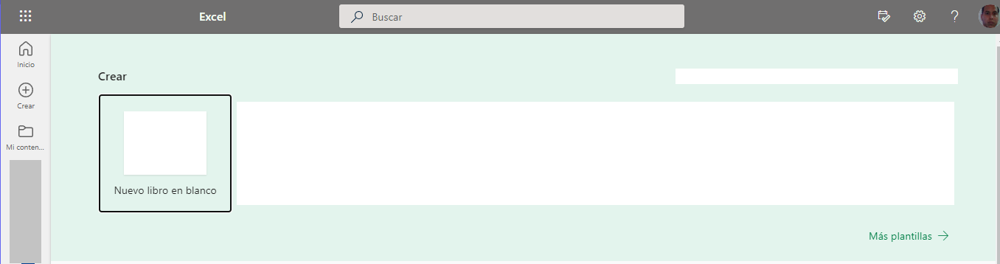


> *Aplicacion Generador de Cuestionarios despues de autenticarse*

> Para los elementos que conforman el componente se trabajara con  PrimeVue; la manera de instalarlo en colocando los siguientes comandos
> por separado en la terminal del VSC:

+ npm install primevue@^3.16.2 --save
+ npm install primeicons --save


## 4.  **Puntos a considerar**

+ Para ejecutar la aplicacion en el VSC se debe abrir la terminarl y ejecutar el comando "npm run serve"

+ Se tiene que configurar el archivo del vue router para crear el mapa de rutas necesario para la navegacion

## AGC


## 5.  **Implementacion**

## AGC

## 6.  **Clases o archivos involucrados**

## AGC

**Clases o archivos**


**Funciones,objetos y tipos de la base de datos**


## 7.  **Observaciones**

## AGC


## 8.  **Pruebas a considerar**

## AGC


## 9.  **Módulos a los que puede afectar, pero deben seguir funcionando correctamente.**

## AGC

**Implementar funcionalidad de diseño**


**Actualizar diseño de cuestionarios con vistas secundarias**


**Actualizar diseño de cuestionarios con estilos de presentación**


**Actualizar movimiento de elementos entre páginas**


**Actualizar niveles de ejecución de acciones (y replica validaciones)**


**Visualización en secciones de contenido (acceso, filtro, cuestionario, encabezado, terminar,observaciones, grupo cíclico, grupo diálogo, grid, grupo diseño, matriz)**


**Módulos de modelo de datos (paleta de atributos, consultas, entidades)**


**Actualizar interacción con otros elementos (como los afecta o se afecta)**


**Actualizar el borrado de elementos**


**Compartición de cuestionarios (ro, val, diseño, completo)**


**Actualizar copia e importación de elemento**


**Actualizar PLSQL de copia sección**


**Actualizar PLSQL de copia cuestionario**


**Actualizar validador XML**


**Actualizar importación XML de cuestionario**

	
**Actualizar validaciones al generar XML**


**Actualizar generación XML de cuestionario**

